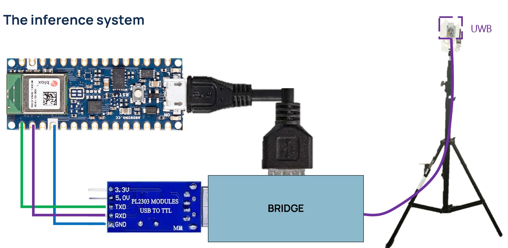

# Radar Ranging Project

This project contains two programs:

### **1. `bridge.py`**

Connects **live radar data** or **saved logs** to the **TinyML model** running on a microcontroller.

### **2. `logger.py`**

Records **raw radar frames** from the radar and saves them as `.npy` files (to be replayed later using the bridge).

typically:

1. Use **logger.py** to record radar data
2. Train their TinyML model
3. Use **bridge.py** to play data into the TinyML board (live or from logs)

---
## 📦 Installation

### 1. Install Python

Python is the programming language this project uses.

* Go to the official Python download page: [https://www.python.org/downloads/](https://www.python.org/downloads/)
* Download Python **3.10 or newer** for your system.
* **Important:** During installation, check the box **“Add Python to PATH”**. This makes it easier to run Python from the terminal.
* Finish the installation.

To check if Python is installed, open a terminal (Command Prompt / PowerShell / Terminal) and type:

```sh
python --version
```

You should see something like:

```
Python 3.10.x
```


### 2. Install Git

Git is a tool that lets you download (clone) projects from GitHub.

* Download Git from: [https://git-scm.com/downloads](https://git-scm.com/downloads)
* Install it using the default options.

To check if Git is installed, type in the terminal:

```sh
git --version
```

You should see a version number like `git version 2.xx.x`.


### 3. Install Visual Studio Code (VS Code)

VS Code is a code editor where you can open and edit your project.

* Download VS Code: [https://code.visualstudio.com/](https://code.visualstudio.com/)
* Install it using the default options.
* Open VS Code.


### 4. Clone the GitHub project

Now we need a copy of the project on your computer.

1. Open a terminal.
2. Navigate to the folder where you want to store the project. For example:

```sh
cd C:\Users\YourName\Documents
```

3. Clone the project (replace `<GITHUB_PROJECT_URL>` with the actual URL of the project):

```sh
git clone https://github.com/shalbyhazem99/UWB_projects_template
```

4. Go into the project folder:

```sh
cd <PROJECT_FOLDER_NAME>
```


### 5. Create and activate a virtual environment (venv)

A **virtual environment** is like a separate box where Python installs the packages your project needs. This keeps your project isolated from other Python projects on your computer.

1. Create a virtual environment:

```sh
python -m venv venv
```

2. Activate it:

* **Windows (PowerShell):**

```sh
.\venv\Scripts\Activate.ps1
```

* **Windows (Command Prompt):**

```sh
.\venv\Scripts\activate.bat
```

* **macOS/Linux:**

```sh
source venv/bin/activate
```

If it worked, your terminal will show something like `(venv)` at the beginning of the line.


### 6. Install the required packages

Now we need to install the project’s dependencies (packages it uses) inside the virtual environment:

```sh
pip install -r requirements.txt
```

This installs everything the project needs to run.


✅ **Tip:** Every time you open a new terminal to work on this project, make sure to **activate the virtual environment** first (step 5).

---

## ▶️ Logger – Record Radar Data

`logger.py` connects to a radar over serial, receives frames, and saves them into a folder as:

```
<basename>_rx0.npy
<basename>_rx1.npy
<basename>_rx2.npy
```

(one file per receiver)

This recorded data can later be replayed with `bridge.py`.

## ⚙️ Logger Configuration

The logger uses an editable configuration file:

    src/logger_conf.json

This file contains:

-   **`activities`** → the list of activities supported by the logger\
    (you can add new ones simply by expanding the list in the file)

-   **`fps`** → Set to **10** for radar-only projects, or **25** when using radar + ranging

-   **`breathing_address`** → Name/identifier of the breathing belt device

-   **`breathing_connection`** → Specify "ble" or "usb" **(Windows requires USB)**

-   **`ranging_port`** → essential for groups using radar and
ranging together\
    It must be set to **correct radar serial port**.

-   **`datasets_path`** → the name of the folder where all recorded data will be stored\
    (the logger will automatically save each acquisition inside this directory)

## 🚀 How to Run `logger.py`

### **Command**

```sh
python logger.py
```
---

## ▶️ Bridge – Send Data to the TinyML Model

`bridge.py` sends radar frames to the tinyML board in two possible ways:


### 1. Live Radar Mode

Use this mode when the radar is connected and generating data in real time.

### **Command**

```sh
python src/bridge.py --radar <RADAR_PORT> --model <MODEL_PORT>
```

### Example

```sh
python src/bridge.py --radar COM6 --model COM9
```

---

### 2️. Log Replay Mode

Use this mode to replay `.npy` logs recorded with `logger.py`.

### **Command**

```sh
python src/bridge.py --log_folder <FOLDER> --frequency <Hz> --model <MODEL_PORT>
```

### Example

```sh
python src/bridge.py --log_folder datasets/my_log --frequency 10 --model COM9
```

The folder must contain files like:

```
something_rx0.npy  
something_rx1.npy  
something_rx2.npy
```

## 🔌 Hardware Setup -- Connecting Arduino Nano ↔ UART‑TTL Converter

To allow the microcontroller (Arduino Nano) running the TinyML model to
receive radar frames sent by `bridge.py`, you must correctly wire the
**UART‑TTL converter** to the Arduino hardware serial pins.

### 📷 Wiring Diagram



### 🔧 Required Connections

| UART–TTL Converter | Arduino Nano | Description |
|--------------------|--------------|-------------|
| **TX**             | **D0 (RX)**  | Converter transmits → Arduino receives |
| **RX**             | **D1 (TX)**  | Arduino transmits → converter receives |
| **GND**            | **GND**      | Common ground is required |

---

## Signal Analysis Tools

This repository includes a set of Jupyter Notebook–based tools for signal analysis and inspection.  
The notebooks cover breathing rate extraction, inhalation/exhalation visualization, and log inspection for distance alignment and preprocessing.

For details and usage instructions, refer to the dedicated README in this repository [Signal Analysis Tools](tools)

## 💡 Overview of the Workflow

### **1. Record data (optional, using logger.py)**

You run the radar → logger.py saves the data → used for training.

### **2. Replay data or use live radar (using bridge.py)**

bridge.py sends either real-time frames or saved logs to the microcontroller running the TinyML model.
